# Agent Extensions

Every skill, plugin and MCP server your coding agents load, in one list on your Omarchy bar.

Three agents, three sets of config files, three ideas of where a skill lives. Claude Code keeps skills in
`~/.claude/skills`, plugins in a marketplace cache, and its connectors nowhere on disk at all. OpenCode
keeps skills in `~/.config/opencode/skills`, plugins as npm specifiers in `opencode.json`, and lets a
plugin inject MCP servers at runtime that never appear in any list. Codex keeps its own again. Some of it
is the same skill, symlinked into two places, and no view anywhere shows you that.

This widget is that view. One searchable list of everything all three agents can load, grouped by what the
thing is for, with what each one costs you in tokens on every single turn, which agent can see it, and the
command that invokes it — on your clipboard, in the spelling that particular agent expects.

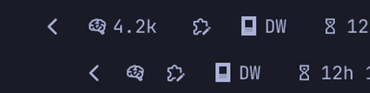

The mark is what you click. Next to it the bar can carry one figure, and the one worth carrying is the
number above: what every skill listing adds to every turn of every session before you have typed a word.

It is the figure for the agent you are actually running. Three agents read three different sets of skills
off one disk and are charged three different bills for them — on this machine OpenCode carries three times
what Claude Code does — so a single number was never honest. The helper reads which of the three has a
live process, straight out of `/proc` and without starting anything, and the bar prints that agent's own
bill. Two of them up prints the two added together, because both are paying. Hover the mark and it says
whose figure you are looking at.

With nothing running it falls back to the heaviest of the three rather than to zero: zero is the true
answer and a useless one, because the bar would read it most of the day and stop being a figure anybody
watches.

The default is the mark on its own, because a bar is contested space and this is a thing you open when you
want it rather than a number you watch. Turn the figure on and the widget re-reads once a minute so it
keeps up with sessions starting and stopping; leave it off and nothing runs at all until you open the
panel.

An Omarchy **Quattro** shell plugin (`bar-widget`). It needs `omarchy-shell` and `python3`, which a stock
Omarchy install already has — ten packages in the base set depend on it. Nothing else.

---

## Install

```
omarchy plugin add https://github.com/oliwier-xiao/agent-extensions-manager.git --enable
```

`--enable` puts it straight on the bar and asks which side you want it on. Leave the flag off and it
installs disabled, so you can read the code first and turn it on later with `omarchy plugin enable
oliwier.agent-extensions-manager`. Either way nothing runs until you open the panel for the first time.

To remove it:

```
omarchy plugin remove oliwier.agent-extensions-manager
```

That takes the widget off the bar and deletes the plugin. If you shelved anything, one file of yours
outlives it — [Removal](#removal) says where it is and what else is safe to delete.

---

## The list

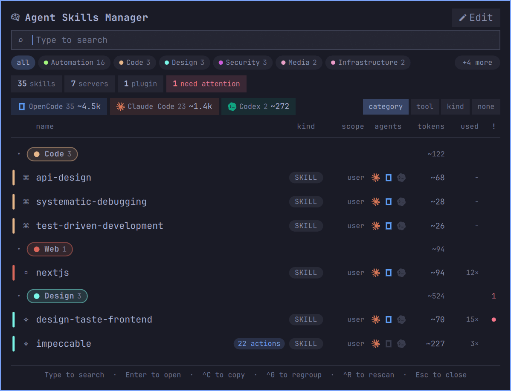

Everything the three agents can load, on one surface. The boxes across the top count it three ways and
each of them is also a filter: by kind, by what is flagged, and by which agent actually loads it. The
figure beside each agent is what its skills cost that agent on every turn.

The three agent boxes rarely agree, and the disagreement is the point. On the machine these screenshots
come from OpenCode carries **33** items for **~4.2k** tokens a turn, Claude Code **23** for **~1.4k**, and
Codex **2** for **~272** — one machine, one set of files on disk, three very different bills. OpenCode
reads Claude Code's skill directory as well as its own, so most of what you installed for one agent is
being paid for twice.

Each row says what the thing is, which agents can see it, what it costs, and how often you have reached
for it. The coloured bar down the left is the shelf it is on.

Every column is named. Seven of them carried numbers and glyphs and not one said what it held: the tilde
made the token figure guessable, and the count beside it — how many times Claude Code records you having
used that skill — was guessable by nobody. The headings sit above the whole list rather than being
repeated inside each shelf, because a shelf's heading sums two of the same columns and is drawn in them.
`~524` under **tokens** is what the three skills on the Design shelf cost together, and the `1` under
**!** is how many of them are flagged.

## What a row knows

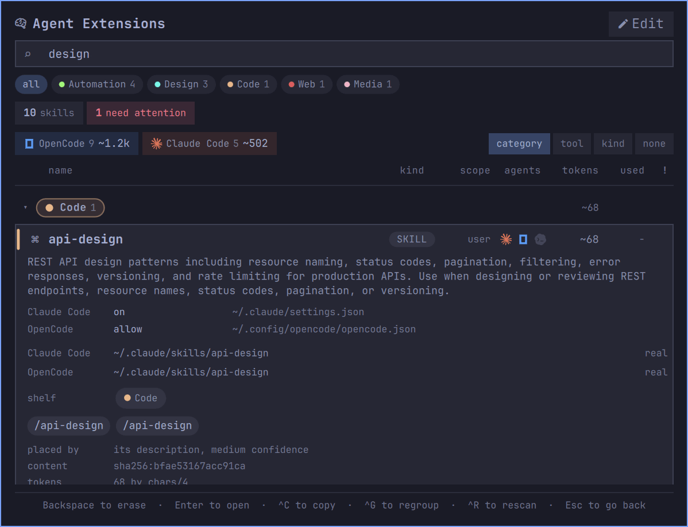

Open a row and it stops summarising. The description is the one the agents actually read — the text that
is costing you the tokens in the corner. Under it, the state each agent has this skill in and **the file
that state is written in**, so a claim on this panel is one you can go and check.

Then every path the skill is reachable from, marked `real` or `symlink`; the shelf, as a control you can
click; the invocation for each agent that can see it; how the shelf was chosen and how confident that
guess was; the content hash the drift check compares; and the token figure with the divisor that produced
it.

Nothing here is a summary of a summary. Every line is either read off disk or computed from something
that was.

## One skill, three agents, five mount points

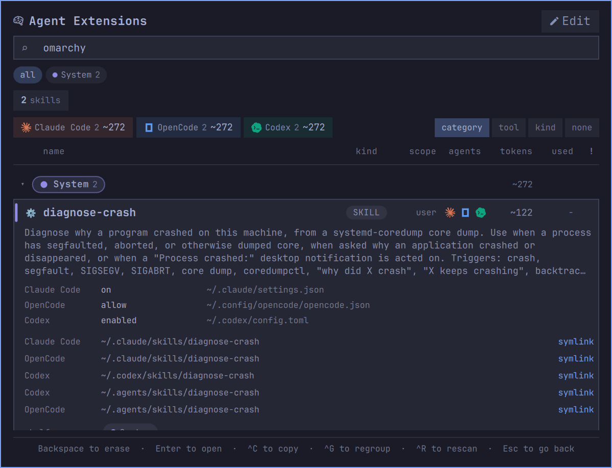

`diagnose-crash` is a single `SKILL.md`. It is reachable from `~/.claude/skills`, `~/.codex/skills` and
`~/.agents/skills`, and because OpenCode reads two of those roots as well, five paths lead to it across
three agents. It is one row carrying three agent marks, not five rows repeating themselves.

Getting that right needs both halves of the comparison. Deduplicating on path alone calls the copies
unrelated; on name alone, identical. So the list resolves every path first, groups by where the file
really is, and then compares content hashes — which is also what lets it tell you when two copies that
share a name have stopped sharing their contents.

## When something needs looking at

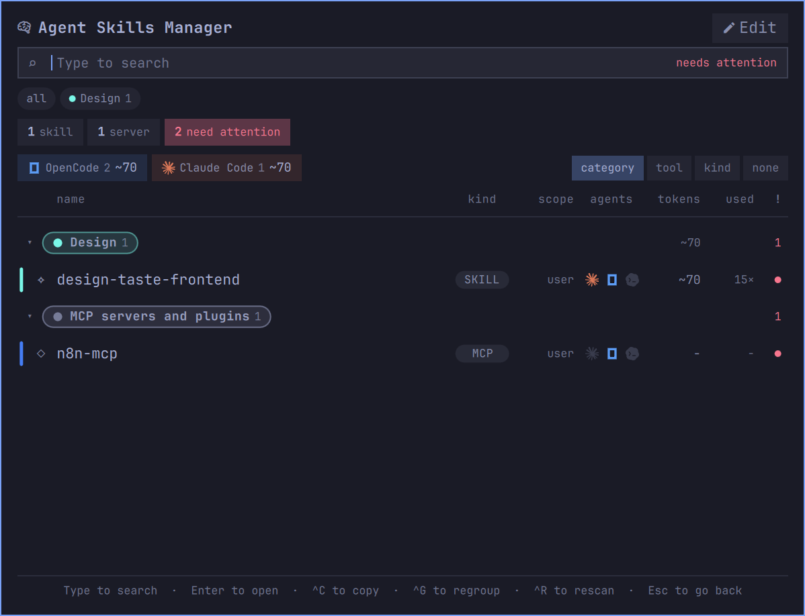

`!` shows only what is flagged, and every count in the header narrows with it. Two things are flagged on
this machine, and no agent reports either.

**One skill answering to two names.** The directory is `taste-skill`; the `SKILL.md` inside it declares
`name: design-taste-frontend`. Claude Code invokes a skill by its directory and OpenCode and Codex by the
name it declares, so the same file is `/taste-skill` in one agent and `/design-taste-frontend` in the
other two. Copy the wrong one and nothing happens, with no error to tell you why. The row carries both,
against the agent each belongs to.

**A server whose token has expired.** `n8n-mcp` is a remote MCP server and its stored credentials have
run out. OpenCode will not say so until the moment you need it.

The list stays quiet about everything else. A shelf the classifier was unsure of is not a problem, and is
not reported as one.

## Copying the command

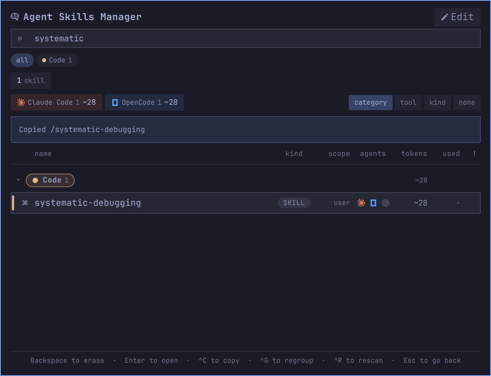

`^C` puts the invocation on your clipboard in the spelling the agent under the cursor expects. Nothing is
claimed until it happens: the panel writes to the clipboard, reads it back, and says **Copied** only when
the read agrees. When the write went to a helper whose exit code has not arrived yet it says *sent to the
clipboard*, and when neither path was reachable it says so in red and prints the command so you can select
it by hand.

A skill that arrives inside a Claude Code plugin is addressed through it, so that row copies
`/impeccable:impeccable` rather than `/impeccable`. Which version of the plugin is read is not guessed
either — the cache can hold several, and `installed_plugins.json` records the one Claude Code actually
loaded.

### Skills that take arguments

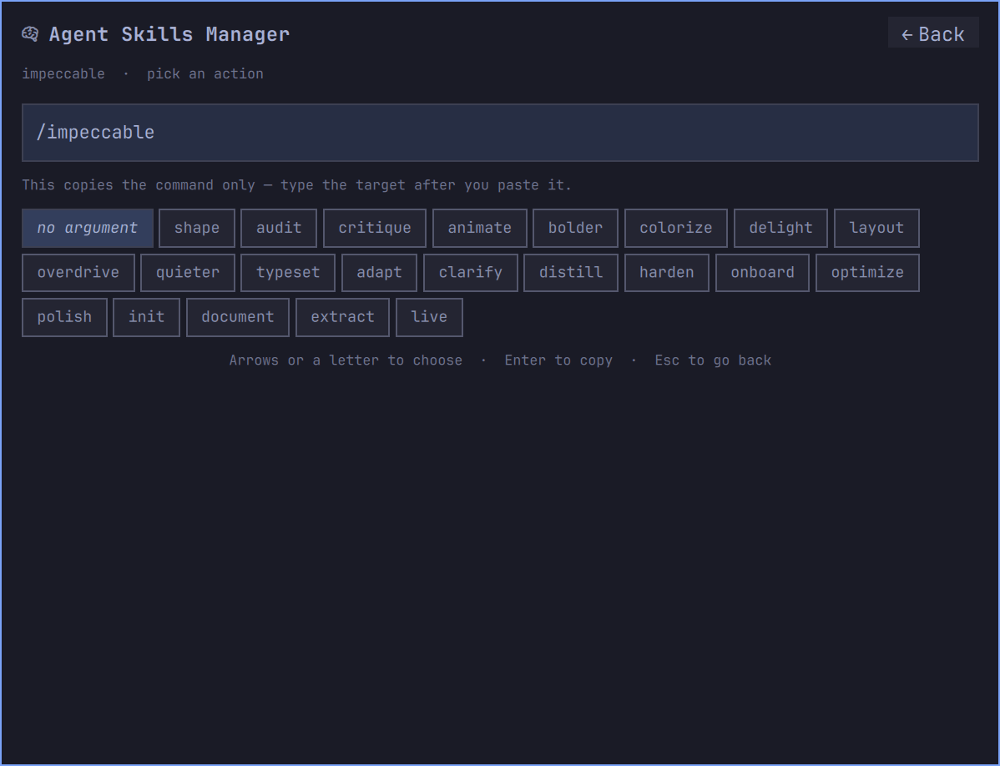

A skill that takes arguments says so in its frontmatter, in `argument-hint`. `impeccable` documents
twenty-two of them in the version installed here, so copying that row and getting `/impeccable` on its own
is not what anybody wanted. The row says **22 actions** and `^C` opens them as a grid instead of copying.

The assembled command is drawn above the options at reading size and updates as you move, so what lands on
your clipboard is on screen before you press Enter rather than something you assemble in your head. Arrows
move; a letter jumps to the next action starting with it, the way a long menu has always worked. **no
argument** is the first option, because sometimes the bare command is what you wanted after all.

Rows without documented arguments copy straight through, unchanged.

## Shelves

Which shelf you keep a skill on is the one thing about it that is yours, and there is nowhere in Claude
Code, OpenCode or Codex to say so. Fourteen shelves are guessed from the description, and a skill the
rules cannot place lands on **Unsorted** rather than being pushed into whichever shelf was the residual.

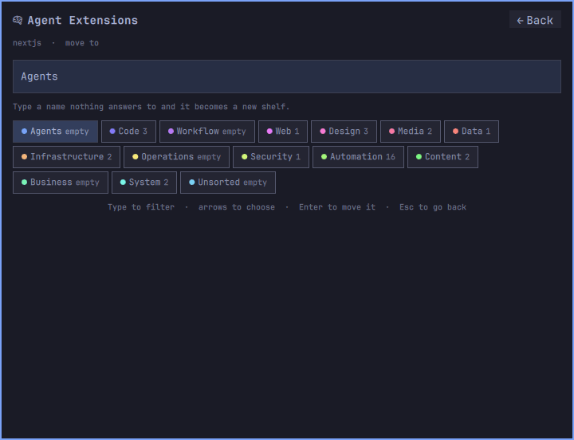

`^M` moves the row. Expanding a row shows its shelf as a control, so the correction is one click from the
thing being corrected — which matters, because a classifier reading descriptions has no idea what you
actually use a skill for and will get some of them wrong. Type a name nothing answers to and it becomes a
new shelf.

A thin guess is still a guess kept. Low confidence means the evidence was thin, not that the answer was
wrong — on the machine this was written for, four of the five low-confidence placements were correct — so
they keep their shelf instead of being swept into Unsorted, and the control above is how the fifth gets
fixed.

A shelf's heading is the same chip the filter strip draws it as: one shape, one dot, one count, in the two
places that mean the same thing. It used to be a bare label with a small dot beside it, and that was not
enough to tell two shelves apart. Fourteen shelves are handed fourteen points around one hue wheel, so
some pair of them is always about twenty-four degrees apart — and twenty-four degrees on a nine-pixel dot
is a difference nobody can use. Web and Design read as the same pink. The walk around the wheel now takes
a stride that puts consecutive shelves most of it apart, lightness and saturation step on cycles of their
own so no two shelves differ on one axis only, and an outlined box carries the colour on a hundred times
the area a dot did.

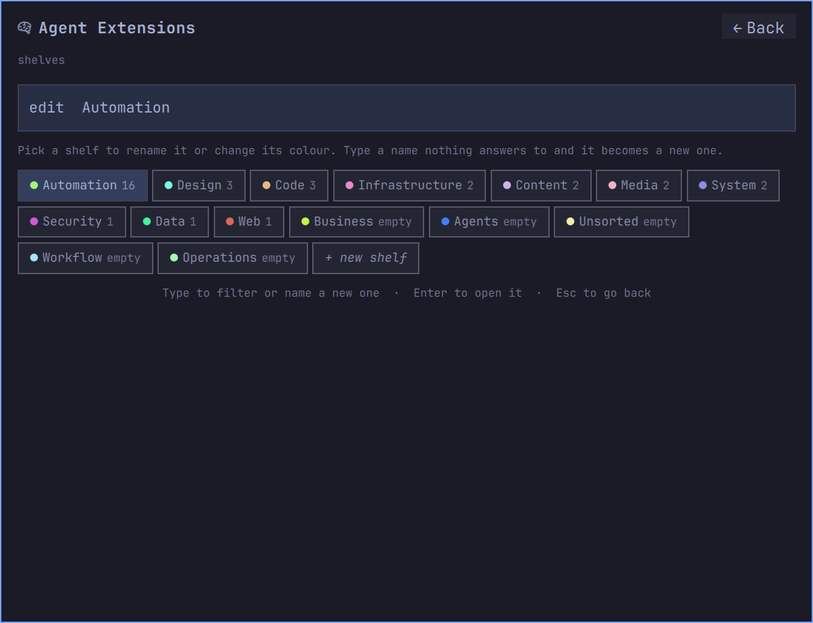

**Edit**, opposite the title, opens all of them at once: every shelf with its colour and its size, and a
standing **+ new shelf** at the end. It is the way in when the shelf you want is not on screen, or does
not exist yet. `^E` does the same from the keyboard.

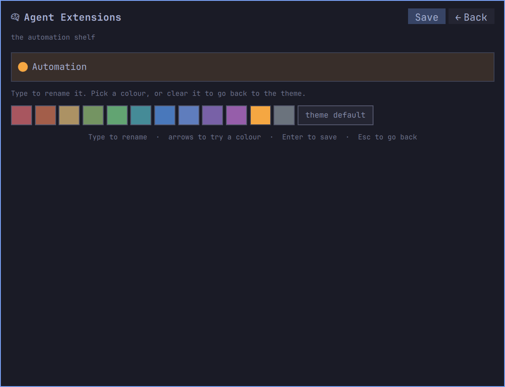

Pick one and you can rename it, recolour it, or clear the colour and go back to the theme's. Trying a
colour on is not choosing one: the swatches preview against the shelf's own name as you arrow through
them, and **Save** commits. It sits in the panel's title row next to **Back**, lit only when there is
something to save.

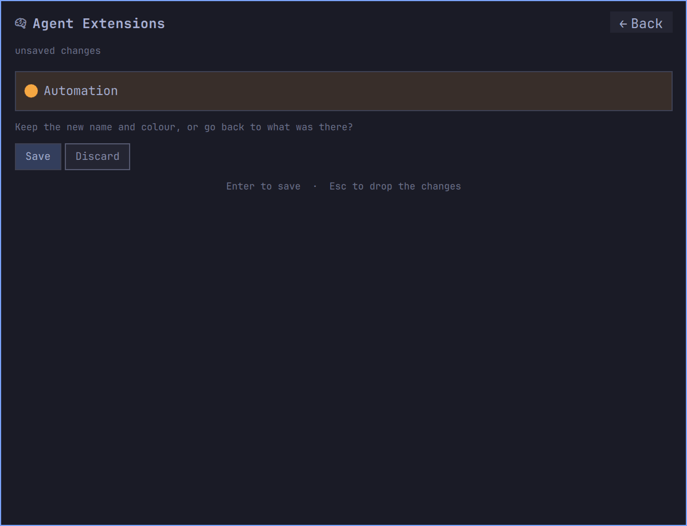

Backing out with something unsaved asks first, on the same surface, rather than dropping work you had no
way of knowing was still a draft.

This is the only thing the widget writes, and it writes it to one file of its own:

```
~/.config/agent-ext/categories.json
```

It names directories and shelves, nothing else. Deleting it restores every guess the classifier made and
loses nothing but your shelving. No file belonging to Claude Code, OpenCode or Codex is written to make a
shelf, and none is written to move a skill between them.

## Filtering and searching

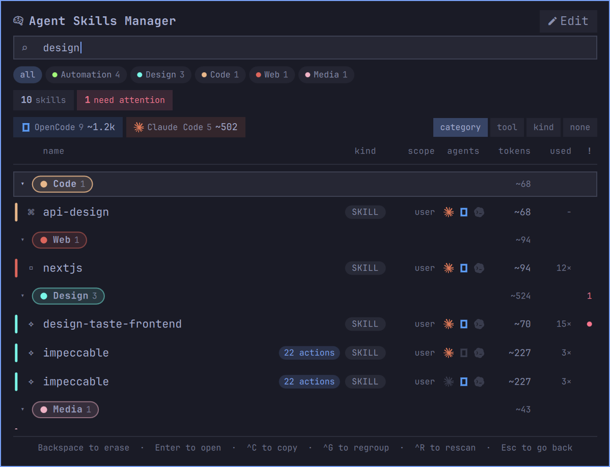

Every printable key goes to the search, including the first one, so a skill whose name starts with `c` or
`g` is reachable by typing it; commands take Ctrl. The search reads names, descriptions, shelves and tags.

Every box along the top is also a filter, and so is every shelf chip below them. Clicking the box that is
already on turns it off, `all` clears every one of them, and one Escape does the same from the keyboard.

The counts stay honest while you use them. Each dimension is counted with every filter except its own, so
picking `servers` leaves the skills box reading its real total rather than 0, and a box that would filter
to nothing is not drawn at all. In the screenshot above one word has taken 39 items down to 10, and all
three agent totals have been recomputed against that.

## Grouping

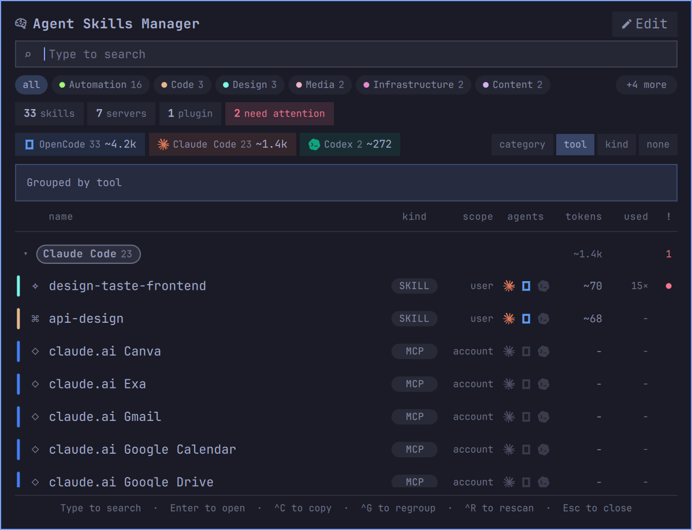

Four boxes at the right of the agent row say what the choices are and take one click to any of them; `^G`
cycles the same four from the keyboard, and the boxes follow it. They are there because a key hint in a
footer is worth nothing to somebody who arrived with a mouse: the only way to find out this list could be
grouped by agent at all was to read that hint and try it.

Fewer than four once you have filtered, because a grouping you have already filtered by is not a grouping.
Pick one agent and grouping by agent is a heading over a list that is entirely that agent; pick **33
skills** and grouping by kind is a heading that says *Skills* over nothing but skills; pick the Design
shelf and grouping by shelf is one header over the three rows you asked for.

The agent case was worse than merely redundant. A skill three agents carry opens a group under each of
them, so filtering to OpenCode and grouping by agent used to put a **Claude Code** heading at the top of
the list you had asked to be OpenCode's, with OpenCode's own group somewhere below the fold.

Each box steps aside for as long as its filter is on, and the list falls back to shelves — or to a flat
list, when the shelf is the thing you filtered by. None of it changes what you chose: clear the filter and
the grouping you had comes back on its own.

The shelf box has one exception, because MCP servers and plugins are filed on the **Agents** shelf and are
grouped in a bucket of their own whatever shelf they claim. Filtering to Agents therefore still leaves two
headings, so grouping by shelf is still doing work and the box stays.

By shelf answers the question you open the panel with — where is the thing that does X. By agent is right
when you are about to switch agents and want to know what that one alone can see. By kind separates skills
from plugins from MCP servers. None gives one flat alphabetical list, which is the fastest thing to
type-search through.

## MCP servers and plugins

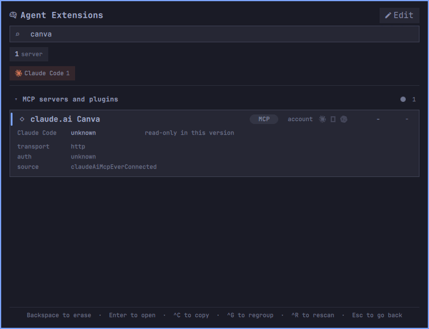

MCP servers are listed beside skills because they are loaded the same way and cost the same kind of money.
Local servers are read from the config files that declare them. Claude Code's account connectors are not
on disk at all; when they cannot be reached, the names Claude Code has recorded are shown with the source
that supplied them, and the row says so rather than inventing a state.

Servers are read-only in this version, and every row says so where you would otherwise expect a switch.
The panel does not draw a control it cannot honour.

## The token figure

Every skill an agent can see puts its name and description into the system prompt on every turn, whether
or not you ever use it. That is the number in each row, and the per-agent total in the boxes at the top.

It is computed the way Claude Code's own extensions browser computes it — the length of the name,
description and when-to-use joined together, divided by four, rounded half up. On this machine that
reproduces fourteen of the fifteen figures the browser shows, to the token. The setting offers a divisor
of three instead, which is closer to how newer models actually tokenise dense technical prose and
therefore closer to what you are really paying; the default matches the browser so the two agree.

## Keys

Every printable key goes to the search. Commands take Ctrl.

| Key | What it does |
|---|---|
| type | search everything: names, descriptions, shelves, tags |
| `Enter` | open the row, or fold and unfold a group header |
| `^C` | copy the invocation, or pick an action first if the skill documents any |
| `^M` | move the row to another shelf, or restyle the shelf under a group header |
| `^E` | open the shelves: rename one, recolour it, or add one |
| `^O` | open where the skill is installed, in your file manager |
| `^G` | regroup by shelf, agent, kind or nothing |
| `^R` | read everything again |
| `!` | show only what needs attention |
| `Esc` | back out one step: the open row, then the filters, then the search, then close |

## Settings

Five, in the widget's own settings panel. Each one says why its default is its default rather than
restating its label.

| Setting | Default | What it decides |
|---|---|---|
| Next to the bar icon | Nothing | whether the bar carries the always-on token figure for whichever agent is running, the number of skills, the count of what is flagged, or nothing at all |
| Group the list by | Category | the grouping the panel opens on |
| Show built-in skills | off | whether the skills each agent ships with are counted; you did not install them and cannot turn them off, so by default only your own things are counted |
| Estimate token cost as | chars/4 | the divisor, or hiding the figure entirely |
| Rescan every time the panel opens | on | turn it off only if you keep skills on a network mount, where a stat of every file is no longer free |

## Requirements

Omarchy 4 with its Quickshell bar, and `python3`. Nothing else, and no Python package beyond the standard
library — the frontmatter reader is deliberately hand-written rather than reaching for PyYAML, which is
not in the Omarchy base set and which rejects real skill files that all three agents read without
complaint.

Whichever of the three agents you actually use is the one you get rows for. An agent that is not installed
is one quiet line saying so, not an error.

The widget reads your agent configuration and never writes to it. The one file it does write is its own,
`~/.config/agent-ext/categories.json`, and only when you shelve something.

## Removal

```
omarchy plugin remove oliwier.agent-extensions-manager
```

If you shelved anything, that file of yours survives the removal, so reinstalling later finds your shelves
again. To clear them:

```
rm -f ~/.config/agent-ext/categories.json
```

Beyond those two paths the footprint is nothing: no cache, no state under `~/.local`, and no file
belonging to Claude Code, OpenCode or Codex modified at any point.

## The command line behind it

The panel draws; `bin/agent-ext` does every byte of the reading and every byte of the one write. It is
worth running on its own.

```
bin/agent-ext doctor
```

```
agent-ext 0.1.0   scan 30.8 ms
skills            39
  claude          16   ~1406 tok always on
  codex            8    ~808 tok always on
  opencode        32   ~4186 tok always on
mcp servers       7
claude plugins    1
running now       claude, opencode
categories        automation 16, agents 5, code 4, design 3, content 2, infra 2, media 2, system 2, ...
```

`bin/agent-ext scan` prints the same inventory as one line of JSON, which is what the panel reads.
`bin/agent-ext category` is the write side, and every one of its verbs is a single named change to the one
file above:

```
bin/agent-ext category list
bin/agent-ext category create ui --label UI --color '#7AA2F7'
bin/agent-ext category assign nextjs ui
bin/agent-ext category unassign nextjs
bin/agent-ext category style ui --reset
```

Every file the helper reads from outside its own checkout is opened once with `O_NOFOLLOW` and
`O_NONBLOCK`, judged on that descriptor rather than on its name, and read back only up to the size that
descriptor vouched for. `omarchy-shell` is one process for the whole desktop, so nothing read on its
behalf may block inside `open(2)` or turn out to be larger than it said it was.

## Development

Tests are plain `unittest` and need nothing that is not already here.

```
python3 -m unittest discover -s tests -v
```

`tests/preflight.sh` checks this repository against the Omarchy plugin marketplace's published rules — the
structural validator, the automated security baseline, and the recurring demands of its manual review —
and exits non-zero on any violation. Run it before proposing a change.

The design and the reasoning behind it are in [docs/DESIGN.md](docs/DESIGN.md); the decisions that shaped
it, and what was deliberately left out, are in [docs/DECISIONS.md](docs/DECISIONS.md).

## License

MIT. See [LICENSE](LICENSE).
