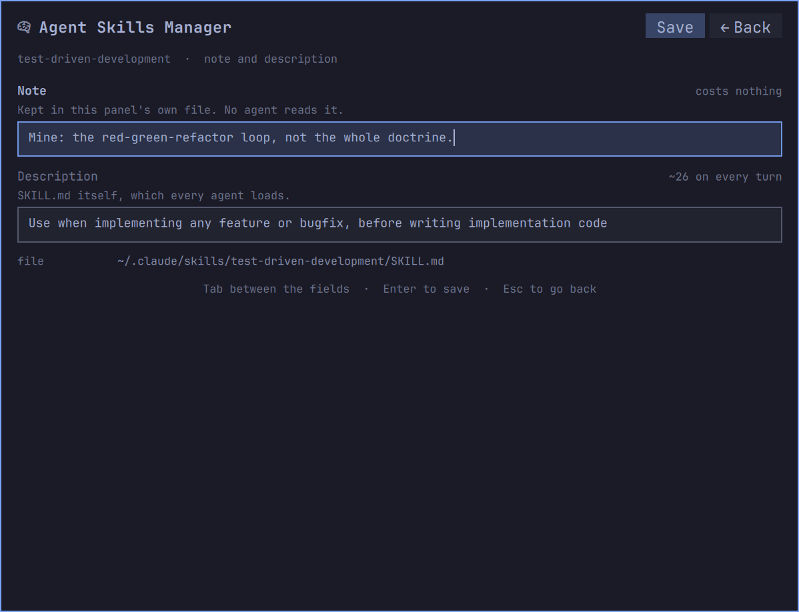
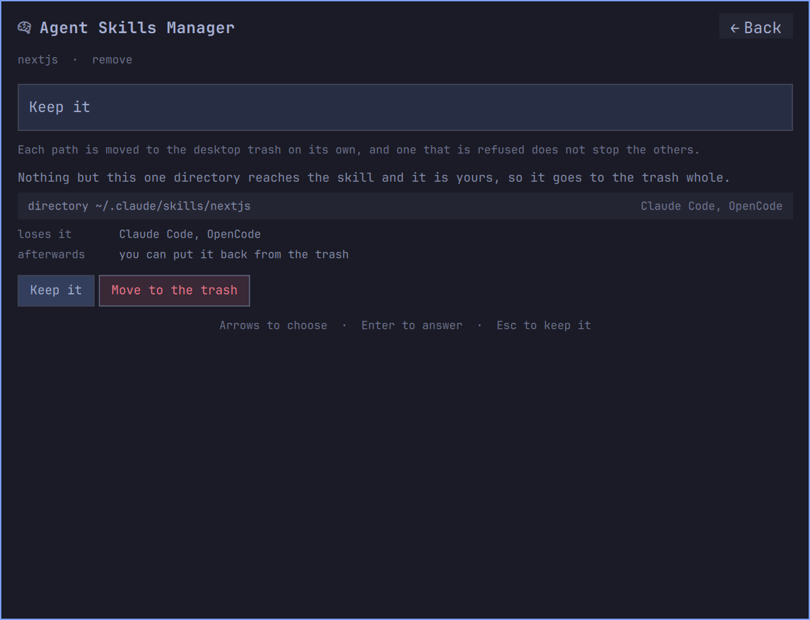

# Agent Skills Manager

Every skill, plugin and MCP server your coding agents load, in one list on your Omarchy bar.

Claude Code, OpenCode and Codex each keep theirs somewhere else — three sets of skill roots, three config
files, and connectors that live nowhere on disk at all. Some of it is the same skill symlinked into two
places, paid for twice. None of the three will tell you what the other two are loading.

This widget is that view: one searchable list of everything all three can load, with what each item costs
you in tokens on every turn, which agent can see it, and the command that invokes it — on your clipboard,
in the spelling that particular agent expects.


The boxes across the top count it three ways — by kind, by what is flagged, by which agent loads it — and
each of them is also a filter. The three agent boxes rarely agree, and the disagreement is the point. On
the machine these screenshots come from, OpenCode carries **35** items for **~4.5k** tokens a turn, Claude
Code **23** for **~1.4k**, and Codex **2** for **~272** — one set of files, three very different bills.
OpenCode reads Claude Code's skill directory as well as its own, so most of what you installed for one
agent is being paid for twice.

An Omarchy 4 (Quattro) shell plugin (`bar-widget`). It needs `omarchy-shell` and `python3`, which a stock
Omarchy install already has.


The mark is what you click. Beside it the bar can carry one figure, and the one worth carrying is above:
what every skill listing adds to every turn before you have typed a word, for the agent you are actually
running. The default is the mark alone, because a bar is contested space — leave the label off and nothing
runs until you open the panel.

---

## Install

```
omarchy plugin add https://github.com/oliwier-xiao/agent-skills-manager.git --enable
```

`--enable` puts it straight on the bar and asks which side you want it on. Leave the flag off to install it
disabled, read the code first, and turn it on later with `omarchy plugin enable
oliwier.agent-skills-manager`.

## What it reads, what it writes

It reads the five directories the three agents keep skills in — `~/.claude/skills`,
`~/.config/opencode/skills`, `~/.codex/skills`, `~/.agents/skills` and `~/.cache/opencode/skills` — plus the
skills inside installed Claude Code plugins, the settings files that say which agent has what turned on, the
MCP server configuration, and `/proc/<pid>/comm` to see which agent is running.

It writes three things of its own, all under your home directory:

| Path | What is in it |
|---|---|
| `~/.config/agent-skills/categories.json` | the categories you filed things under, and whether the **placed by** line is on |
| `~/.config/agent-skills/descriptions.json` | your notes, and any description you rewrote — including the author's original |
| `~/.cache/agent-skills/` | one cached answer from pacman, worth a tenth of a second |

No agent's configuration file is written at any point: nothing here turns a skill on or off, and every row
says so where you would expect a switch. Two things in an agent's own tree can change, each confirmed on
the skill's own card first — the `description:` value of one `SKILL.md`, with the author's own words kept
so you can go back, and a skill directory you have named, which is moved to your desktop trash under
`~/.local/share/Trash` rather than deleted.

---

## The panel

Each row says what the thing is, which agents see it, what it costs, and how often you have reached for it.
The coloured bar down the left is its category.

### Inside a row


Open a row and it stops summarising. The description is the one the agents actually read — the text costing
you the tokens in the corner. Under it, the state each agent has this skill in and **the file that state is
written in**, so a claim on this panel is one you can go and check.

Then every path it is reachable from, marked `real` or `symlink`; its category, as a control you can click;
the invocation for each agent; how the category was chosen and how confident that guess was; the version
its author declared, where one is declared at all; the content hash the drift check compares; and the token
figure with the divisor that produced it. **edit** and **delete** sit in the corner.

Nothing here is checked against anywhere upstream. A skill directory is not a checkout — it has no remote,
no recorded commit and usually no version — so there is no honest way to say whether a newer one exists,
and the panel does not pretend otherwise. Where two copies of one name declare different versions, that is
reported as drift, which is a comparison between two things it can actually see.

### One skill, several agents


`diagnose-crash` is a single `SKILL.md`, reachable from `~/.claude/skills`, `~/.codex/skills` and
`~/.agents/skills` — and because OpenCode reads two of those roots too, five paths lead to it across three
agents. It is one row carrying three agent marks, not five rows repeating themselves. Two copies that share
a name and have stopped sharing their contents are flagged as drift.

### What gets flagged


`!` shows only what needs looking at, and every count in the header narrows with it. One thing is flagged
here, and no agent reports it: **a skill answering to two names.** The directory is `taste-skill`; the
`SKILL.md` inside declares `name: design-taste-frontend`. Claude Code invokes a skill by its directory,
OpenCode and Codex by the name it declares — so the same file is `/taste-skill` in one and
`/design-taste-frontend` in the other two. Copy the wrong one and nothing happens, with no error to say
why. The row carries both, against the agent each belongs to.

An expired MCP token is flagged the same way, on the server's own row, because OpenCode will not say so
until the moment you need it.

The list stays quiet about everything else. A category the classifier was unsure of is not a problem, and
is not reported as one.

---

## Copying the command


`^C` puts the invocation on your clipboard in the spelling the agent under the cursor expects. Nothing is
claimed until it happens: the panel writes, reads back, and says **Copied** only when the read agrees. It
says **Sent to the clipboard** where it had to shell out and cannot read the result back, and if neither
path was reachable it says so in red and prints the command for you to select by hand.

A skill arriving inside a Claude Code plugin is addressed through it, so that row copies
`/impeccable:impeccable` rather than `/impeccable`. Which version is read is not guessed either — the cache
can hold several, and `installed_plugins.json` records the one Claude Code actually loaded.

### Skills that take arguments


A skill that takes arguments says so in its frontmatter, in `argument-hint`. `impeccable` documents
twenty-two of them, so copying that row and getting `/impeccable` on its own is not what anybody wanted.
The row says **22 actions** and `^C` opens them as a grid instead.

The assembled command is drawn above the options at reading size and updates as you move, so what will land
on your clipboard is on screen before you press Enter. Arrows move; a letter jumps to the next action
starting with it. **no argument** is the first option, because sometimes the bare command was the point.
Rows without documented arguments copy straight through.

---

## Categories

Which category a skill belongs in is the one thing about it that is yours, and there is nowhere in Claude
Code, OpenCode or Codex to say so. Fourteen are guessed from the description, and a skill the rules cannot
place lands in **Unsorted** rather than being pushed into whichever one was the residual.


`^M` moves a row, and an expanded row shows its category as a control — so the correction sits next to the
thing being corrected. Type a name nothing answers to and it becomes a new one.

An expanded row says how it was filed on its **placed by** line — the marketplace listing, the skill's own
frontmatter, where it is installed, its description and how sure that was, or you. It is worth reading
while you are deciding whether to trust the filing, and repetition on every card afterwards, so the `×` at
the end of the line turns it off everywhere at once. The category index carries a **show placed by** chip
while it is off, and that is the way back.


**Edit**, opposite the title, opens all of them at once with a standing **+ new category** at the end —
the way in when the one you want is not on screen, or does not exist yet. `^E` does the same from the
keyboard.


Pick one and you can rename it, recolour it, or clear the colour and fall back to the theme's. Trying a
colour on is not choosing one: swatches preview against the category's own name as you arrow through them,
and **Save** commits.


Backing out with something unsaved asks first, on the same surface, rather than dropping work you had no
way of knowing was still a draft.

---

## Notes and descriptions



`^D` on an open row, or **edit** in the corner of its card. Two fields, and they have nothing to do with
each other.

**The note** is yours and starts empty. It is drawn above the description in this skill's card, no agent
ever sees it, and it is in no figure anywhere. Write what the skill is for in your own words, or in your
own language — the search reads it too.

**The description** is the one in `SKILL.md`, and saving it writes that file. This is the text every agent
copies into its system prompt on every turn, so it is the whole of what the skill costs you, and the
editor shows the figure moving as you cut. Eight wordy skills on the machine these screenshots come from
are a third of the bill.

Only the `description:` value changes. Everything else in the file comes through byte for byte, and the
file is read back afterwards through the same parser the agents use — if the result does not read as
exactly what you typed, the original goes back and nothing is saved. **Return to default** restores the
author's own words, kept from the moment you first wrote over them.

Where a file cannot be written the editor says so instead of offering the control: the two skills Omarchy
ships under pacman, and the six Codex rewrites from an embedded copy on every launch. Where it can be
written but will not last it says that too — a plugin update replaces its own checkout, and OpenCode
re-fetches what it caches. A skill installed twice is two files, and the copy that did not get the rewrite
says where it went.

---

## Removing a skill



`^Del` asks whether to get rid of the skill under the cursor — or **delete**, beside **edit** in the corner
of its card. It changes something outside this widget's own files, so it asks first, the question names
what will actually happen rather than the name of the row, and it opens on the answer that changes nothing.

Which is not one question, because a skill is not one thing on disk. Four answers, and the helper decides
which before the panel draws anything:

**It is yours, so it goes to the trash.** Every path that reaches it, listed by name — links first, then
the directory itself — with which agents stop seeing it and which, if any, still will. Nothing is
deleted: each path is handed to `gio trash`, so it lands in the same desktop trash as everything else and
comes back the same way.

**A package owns it, so only your links can go.** `omarchy` and `diagnose-crash` live in
`/usr/share/omarchy`, owned by pacman and reached from your directories by symlink. The directory itself
is not yours to remove and is never offered; the links are, and the panel says that Omarchy re-creates
them when it next provisions your user, so removing them may not be final.

**A plugin brought it, so the plugin is where it goes.** A skill that arrives inside a Claude Code plugin
is not a thing you can remove on its own without breaking the plugin around it. The row says so and shows
the command that would do it properly.

**Nothing would happen, so nothing is offered.** Codex rewrites the six skills under its `.system`
directory from an embedded copy every time it launches. Removing one is undone before you next look at it,
and a panel that offered the button anyway would be lying about what it can do.

If a link cannot be moved, the directory it points at is left where it is too, because a trashed skill with
a live link still pointing at it is worse than either.

---

## Search and filters


Every printable key goes to the search, including the first, so a skill starting with `c` or `g` is
reachable by typing it; commands take Ctrl. The search reads names, descriptions, your notes, categories
and tags. Every box along the top is a filter, and so is every category chip below them — clicking the one
already on turns it off, `all` clears them, and Escape does the same.

The counts stay honest as you narrow. Each dimension is counted with every filter except its own, so
picking `servers` leaves the skills box reading its real total rather than 0, and a box that would filter
to nothing is not drawn at all.

### Grouping


By category answers the question you open the panel with — where is the thing that does X. By tool is right
when you are about to switch agents and want to know what that one alone can see. By kind separates skills
from plugins from MCP servers. None gives one flat alphabetical list, which is the fastest thing to
type-search through.

Four boxes at the right of the agent row take one click to any of them, and `^G` cycles the same four.
Fewer than four once you have filtered, because a grouping you have already filtered by is not a grouping:
pick one agent, and grouping by tool is a heading over a list that is entirely that agent. Each box steps
aside for as long as its filter is on and comes back when you clear it.

---

## MCP servers and plugins


MCP servers are listed beside skills because they load the same way and cost the same kind of money. Local
ones are read from the config files that declare them. Claude Code's account connectors are not on disk at
all; when they cannot be reached, the names Claude Code has recorded are shown with the source that
supplied them, and the row says so rather than inventing a state.

A server's command line can carry a credential, so anything secret-shaped in it — a header, a token flag, a
key in a URL — is replaced before it can be drawn. Servers are read-only in this version, and every row
says so where you would otherwise expect a switch.

## The token figure

The length of the name, description and when-to-use joined, divided by four, rounded half up — computed the
way Claude Code's own extensions browser computes it. On this machine that reproduces fourteen of the
fifteen figures the browser shows, to the token. That is the number in each row, and the per-agent total in
the boxes at the top; a skill an agent can see is in its system prompt on every turn whether or not you use
it.

The setting offers a divisor of three instead, closer to how newer models tokenise dense technical prose
and therefore closer to what you are really paying; the default matches the browser so the two agree.

---

## Keys

| Key | What it does |
|---|---|
| type | search everything: names, descriptions, your notes, categories, tags |
| `Enter` | open the row, or fold and unfold a group header |
| `^C` | copy the invocation, or pick an action first if the skill documents any |
| `^M` | move the row to another category, or restyle the category under a group header |
| `^E` | open the categories: rename one, recolour it, or add one |
| `^O` | open where the skill is installed, in your file manager |
| `^D` | open the note and the description for editing |
| `^Z` | put the author's description back, from the row or from inside the editor |
| `^Del` | ask whether to move the skill under the cursor to the trash |
| `^G` | regroup by category, tool, kind or nothing |
| `^R` | read everything again |
| `!` | show only what needs attention, while the search is empty |
| `Esc` | back out one step: the open row, then the filters, then the search, then close |
| `Tab` | move to the next panel on the bar; Shift-Tab the previous |

## Settings

Five, in the widget's own settings panel.

| Setting | Default | What it decides |
|---|---|---|
| Next to the bar icon | Nothing | whether the bar carries the always-on token figure for whichever agent is running, the number of skills, the count of what is flagged, or nothing |
| Group the list by | Category | the grouping the panel opens on |
| Show built-in skills | off | whether the skills each agent ships with are counted; you did not install them and cannot turn them off, so by default only your own things are |
| Estimate token cost as | chars/4 | the divisor, or hiding the figure entirely |
| Rescan every time the panel opens | on | turn it off only if you keep skills on a network mount, where a stat of every file is no longer free |

## Requirements

Omarchy 4 with its Quickshell bar, and `python3` at `/usr/bin/python3` — the standard library only, no
Python package to install. The panel spawns that path outright rather than letting a shebang search `PATH`;
if yours is elsewhere, the panel opens empty while the helper still works in a terminal.

Removal needs `/usr/bin/gio`, from `glib2`, which a stock Omarchy install already has because most of the
desktop depends on it. Without it the panel still reads everything and only the removal is refused.

Whichever of the three agents you actually use is the one you get rows for. An agent that is not installed
is one quiet line saying so, not an error.

## Update

```
omarchy plugin update oliwier.agent-skills-manager
omarchy restart shell
```

The restart is not optional. The shell reloads a plugin by re-reading its directory, but a QML component it
has already built keeps the code it was built from — so the widget on your bar goes on running the old
version, with nothing to tell you: the new files are on disk and `omarchy plugin list` shows the new
number. It is a known Quickshell component-cache limitation, reported upstream several times over.

## Remove

```
omarchy plugin remove oliwier.agent-skills-manager
```

Your own files outlive it, so reinstalling later finds your filing, your notes and your rewritten
descriptions again. To clear them:

```
rm -rf ~/.config/agent-skills ~/.cache/agent-skills
```

The first holds the two files named at the top of this README. Deleting it takes your notes with it, and
takes the author's original along with any description you rewrote — so a skill still carrying your text is
left with nothing to put back. The second is one cached answer from pacman.

## The command line

The panel draws; `bin/agent-skills` does every byte of the reading and every one of the writes — the
category store, the description, and the removal. It is worth running on its own, and it counts skills
only, where the panel's agent boxes count everything an agent loads.

```
bin/agent-skills doctor
```

```
agent-skills 0.1.0   scan 22.6 ms
skills            41
  claude          16   ~1406 tok always on
  codex            8   ~808 tok always on
  opencode        34   ~4460 tok always on
mcp servers       7
claude plugins    1
running now       claude, opencode
categories        automation 16, agents 5, code 4, design 3, security 3, content 2, infra 2, media 2, system 2, data 1, web 1
```

`bin/agent-skills scan` prints the same inventory as one line of JSON, which is what the panel reads;
`--pretty` indents it and `--divisor 3` re-costs it.

`bin/agent-skills category` writes only `~/.config/agent-skills/categories.json`, and every verb is a
single named change to it:

```
bin/agent-skills category list
bin/agent-skills category create ui --label UI --color '#7AA2F7'
bin/agent-skills category assign nextjs ui
bin/agent-skills category unassign nextjs
bin/agent-skills category style ui --reset
bin/agent-skills category placed-by hide
```

`bin/agent-skills describe` is one of the two verbs that touch a file this plugin did not write. `note` is
yours alone and goes in the widget's own store, where no agent reads it. `write` replaces the
`description:` value of one `SKILL.md` and passes every other byte through, keeping the author's line so
`reset` is exact. Both name the file as well as the skill, because one name reaches more than one
`SKILL.md`, and the path is refused unless the name given actually reaches it:

```
bin/agent-skills describe note nextjs 'why I keep this'
bin/agent-skills describe write nextjs /home/you/.claude/skills/nextjs/SKILL.md 'A shorter description.'
bin/agent-skills describe reset nextjs /home/you/.claude/skills/nextjs/SKILL.md
```

`--expect` on `write` carries the description the row was drawn from and refuses if the file no longer says
it. Leave the text off `note` to clear the one that is there.

`bin/agent-skills remove` is the other. Paths must be absolute, and they are meant to come from a scan's
`removal.targets` rather than be typed:

```
bin/agent-skills remove --dry-run -- /home/you/.claude/skills/nextjs
bin/agent-skills remove -- /home/you/.claude/skills/nextjs
```

`--dry-run` runs every check and prints JSON saying what would go without touching anything, which is the
form worth reaching for first. Neither form deletes: each path is handed to `gio trash` on its own, and the
answer says which ones moved and, for each one that did not, why. Every path is re-examined at the moment
it is acted on rather than trusted from the row that asked — if the skill moved, changed owner or stopped
being a skill since the panel drew it, that path is refused and the others carry on.

Every file read under a scanned root is opened once with `O_NOFOLLOW` and `O_NONBLOCK` and judged on that
descriptor rather than on its name, because `omarchy-shell` is one process for the whole desktop and
nothing read on its behalf may block or turn out to be larger than it said it was. A file that is refused
is reported as refused rather than treated as absent: an empty list and a list that could not be read look
identical and mean opposite things.

## Development

Tests are plain `unittest` and need nothing that is not already here.

```
python3 -m unittest discover -s tests -v
```

`tests/preflight.sh` checks this repository against the Omarchy plugin marketplace's published rules — the
structural validator, the automated security baseline, and the recurring demands of its manual review — and
exits non-zero on any violation. CI runs it on every push and pull request, so run it before proposing a
change and meet it locally rather than on the branch.

## License

MIT. See [LICENSE](LICENSE).
